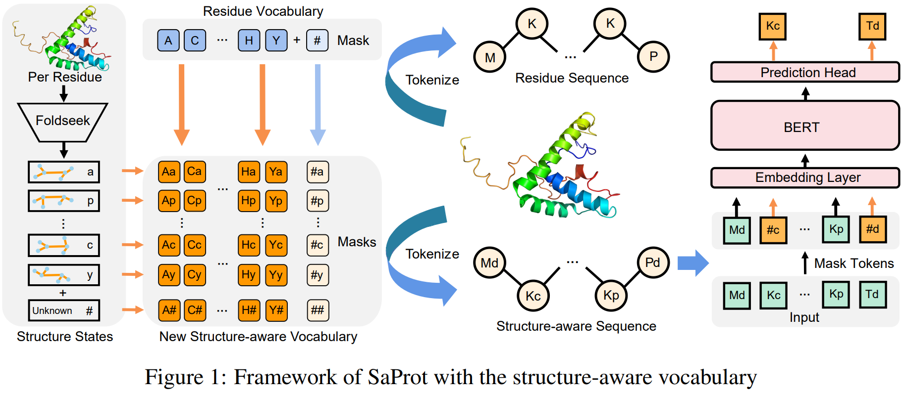

# SaProt: Protein Language Modeling with Structure-aware Vocabulary
The repository is an official implementation of [SaProt: Protein Language Modeling with Structure-aware Vocabulary](https://www.biorxiv.org/content/10.1101/2023.10.01.560349v2).

If you have any questions about the paper or the code, feel free to raise an issue!
## Overview
We proprose a structure-aware vocabulary for protein language modeling. The vocabulary is constructed by encoding the 
protein structure into discrete 3D tokens by using the [foldseek](https://github.com/steineggerlab/foldseek). We combine the residue tokens and the structure tokens to form a structure-aware sequence. 
Through large-scale pre-training, our model, i.e. SaProt, can learn the relationship between the structure and the sequence.
For more details, please refer to our paper https://www.biorxiv.org/content/10.1101/2023.10.01.560349v2.


## Installation
### Create a virtual environment
```
conda create -n SaProt python=3.10
conda activate SaProt
```
### Install packages
```
bash environment.sh  
``` 
 
## Prepare the SaProt model
We provide two ways to use SaProt, including through huggingface class and 
through the same way as in [esm github](https://github.com/facebookresearch/esm). Users can choose either one to use. 

### Huggingface model
We provide [SaProt](https://huggingface.co/westlake-repl/SaProt_650M_AF2) and 
[SaProt-PDB](https://huggingface.co/westlake-repl/SaProt_650M_PDB) for various use cases
. The following code shows how to load the model.
```
from transformers import EsmTokenizer, EsmForMaskedLM

model_path = "/your/path/to/SaProt_650M_AF2"
tokenizer = EsmTokenizer.from_pretrained(model_path)
model = EsmForMaskedLM.from_pretrained(model_path)

#################### Example ####################
device = "cuda"
model.to(device)

seq = "MdEvVpQpLrVyQdYaKv"
tokens = tokenizer.tokenize(seq)
print(tokens)

inputs = tokenizer(seq, return_tensors="pt")
inputs = {k: v.to(device) for k, v in inputs.items()}

outputs = model(**inputs)
print(outputs.logits.shape)

"""
['Md', 'Ev', 'Vp', 'Qp', 'Lr', 'Vy', 'Qd', 'Ya', 'Kv']
torch.Size([1, 11, 446])
"""
```

### esm model
The esm version is also stored in the same huggingface folder, named `SaProt_650M_AF2.pt`. We provide a function to load the model.
```
from utils.esm_loader import load_esm_saprot

model_path = "/your/path/to/SaProt_650M_AF2.pt"
model, alphabet = load_esm_saprot(model_path)
```

## Convert protein structure into structure-aware sequence
We provide a function to convert a protein structure into a structure-aware sequence. The function calls the 
[foldseek](https://github.com/steineggerlab/foldseek) 
binary file to encode the structure. You can download the binary file from [here](https://drive.google.com/file/d/1B_9t3n_nlj8Y3Kpc_mMjtMdY0OPYa7Re/view?usp=sharing) and place it in the `bin` folder
. The following code shows how to use it.
```
from utils.foldseek_util import get_struc_seq
pdb_path = "example/8ac8.cif"

# Extract the "A" chain from the pdb file and encode it into a struc_seq
# pLDDT is used to mask low-confidence regions if "plddt_path" is provided
parsed_seqs = get_struc_seq("bin/foldseek", pdb_path, ["A"])["A"]
seq, foldseek_seq, combined_seq = parsed_seqs

print(f"seq: {seq}")
print(f"foldseek_seq: {foldseek_seq}")
print(f"combined_seq: {combined_seq}")
```

## Prepare dataset
We provide datasets that are used in the paper. Datasets can be downloaded from 
[here](https://drive.google.com/drive/folders/11dNGqPYfLE3M-Mbh4U7IQpuHxJpuRr4g?usp=sharing).

Once downloaded, the datasets need to be decompressed and placed in the `LMDB` folder for supervised fine-tuning.

## Fine-tune SaProt
We provide a script to fine-tune SaProt on the datasets. The following code shows how to fine-tune SaProt on specific
downstream tasks. Before running the code, please make sure that the datasets are placed in the `LMDB` folder and the
huggingface version of SaProt model is placed in the `weights/PLMs` folder. **Note that the default training setting is not as 
same as in the paper because of the hardware limitation for different users. We recommend users to modify the yaml file 
flexibly based on their own conditions (i.e. batch_size, devices and accumulate_grad_batches).**
```
# Fine-tune SaProt on the Thermostability task
python scripts/training.py -c config/Thermostability/saprot.yaml

# Fine-tune ESM-2 on the Thermostability task
python scripts/training.py -c config/Thermostability/esm2.yaml
```
### Record the training process (optional)
If you want to record the training process using wandb, you could modify the config file and set `Trainer.logger = True`
and then paste your wandb API key in the config key `setting.os_environ.WANDB_API_KEY`. Other settings can be modified
flexibly for your own needs.

## Evaluate zero-shot performance
We provide a script to evaluate the zero-shot performance of models (foldseek binary file is required to be placed in
the `bin` folder):
```
# Fine-tune SaProt on the ProteinGym benchmark
python scripts/mutation_zeroshot.py -c config/ProteinGym/saprot.yaml

# Fine-tune ESM-2 on the ProteinGym benchmark
python scripts/mutation_zeroshot.py -c config/ProteinGym/esm2.yaml
```
The results will be saved in the `output/ProteinGym` folder.